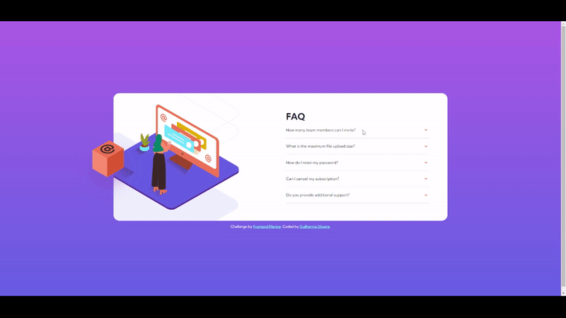

# Frontend Mentor - FAQ accordion card solution

This is a solution to the [FAQ accordion card challenge on Frontend Mentor](https://www.frontendmentor.io/challenges/faq-accordion-card-XlyjD0Oam).

## Table of contents

- [Overview](#overview)
  - [The challenge](#the-challenge)
  - [Screenshot](#screenshot)
  - [Links](#links)
- [My process](#my-process)
  - [Built with](#built-with)
  - [What I learned](#what-i-learned)
  - [Continued development](#continued-development)
  - [Useful resources](#useful-resources)
- [Author](#author)

## Overview

### The challenge

Users should be able to:

- View the optimal layout for the component depending on their device's screen size
- See hover states for all interactive elements on the page
- Hide/Show the answer to a question when the question is clicked

### Screenshot

### Links

- Solution URL: [Frontend Mentor](https://your-solution-url.com)
- Live Site URL: [GitHub Pages](https://guisilveira.github.io/FAQ-Accordion-Card/)

## My process

### Built with

- Semantic HTML5 markup
- CSS custom properties
- Flexbox
- Mobile-first workflow
- JavaScript

### What I learned

I learned a lot about absolute positioning, animations and how to keep the layout responsive.

### Continued development

My wish is to keep learning more about the mobile-first workflow because I really enjoyed it and it feels much more easy to scale up to desktop.

### Useful resources

- [CSS Tricks](https://css-tricks.com/) - CSS Tricks helped me to learn more about animations and the position property.
- [Text Animations](https://alvarotrigo.com/blog/css-text-animations/) - This gave me the ideas i wanted to make the animations on the text.

## Author

- LinkedIn - [Guilherme Silveira](https://www.linkedin.com/in/guilherme-silveira-coutinho/)
- Frontend Mentor - [@GuiSilveira](https://www.frontendmentor.io/profile/GuiSilveira)
